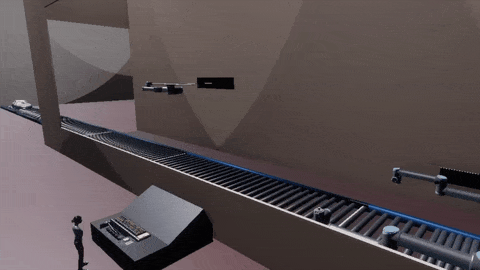
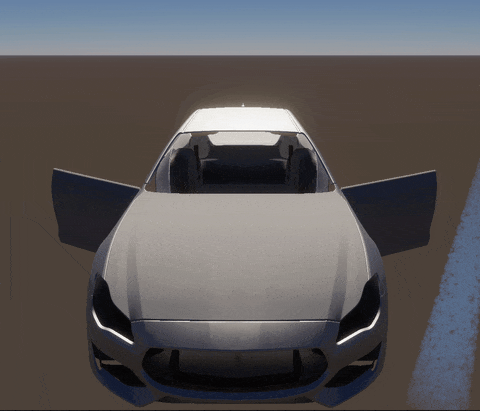
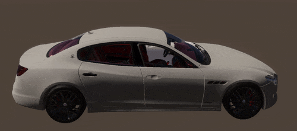
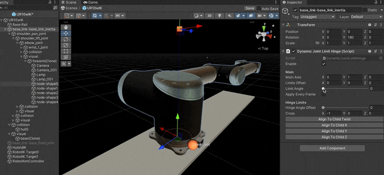

## Introduction

  <em>Final Simulation Overview</em>

## Prerequisites

* Unity 2021.3 (LTS) or higher
* Python 3.10, installed with all the pacakges listed in `Scripts/requirements.txt`. This can be done using `pip install -r requirements.txt`.

## Quick Start

* Open the `IntegratedFactoryScene` scene in the `Scenes` folder
* Run the Python script `image-analyzer.py` in the `Scripts` folder at the root. =
* Play the scene
* Change Parameters: 
  - In the top left of the screen, toggle on/off the Control Panel
  - Click on the Tabs on the left to see the different categories of parameters available to be changed
  - Enter a value (must be a number)
* Check analytics

## About this project

### Scene Hierarchy

The `IntegratedFactoryScene` contains the complete car painting simulation. This simulation is vaguely divided into 5 rooms:

- Spawn Room: Cars are continuously spawned here as the last car enters the Painting Room. The distance at which it is spawned is user modifiable.
- Painting Room: Cars are painted in the Painting Room as they pass the robots.
- Buffer Room: Cars speed up in the Buffer Room, so that they have a larger gap between them.
- CV Room: Cars stop in the CV Room and their pictures are taken from 3 views; left, right and top
- QA Room: Cars then move through the QA Room. Their flaws are displayed on the panel (green for minor flaws, red for major flaws). They are moved to the side so that Operators can fix these flaws, and are then sent along and marked as "Processed"

The `IntegratedFactoryScene` contains the following major GameObjects:

- **Simulation Manager**: Controls the entire simulation. It has 3 important components:
  - Simulation Manager, which drives the simulation.
  - Analysis Manager, which listens for data from Python after CV analysis of each car
  - Simulation Time Tracker, which tracks the passage of time in the simulation
- **Structure and Lighting**: This contains the overall virtual environment. A key child GameObject here is [QARoomLighting](#cv) under `Lighting`, as it contains the CV Light Array and the Cameras in it that capture images to be analyzed
- **Painting Room**: The `Bots` child GameObject under it contains the three spray painting robots 
- **QA Room**: This contains the `Visuals` GameObject, that displays live analysis visuals, and the `Operators` GameObject, that holds the operators in the scene that fix thre cars.
- **CentralConveyor**: This contains the central conveyor belt that run through the scene. It is further subdivided for each room, and each room can be controlled using the `ConveyorController` component on each child GameObject. 

### Spray Painting

  <em>Spraying Test using Paint In 3D</em>

- Spray Painting using PaintIn3D asset from Asset Store: ([Paint in 3D | Painting | Unity Asset Store](https://assetstore.unity.com/packages/tools/painting/paint-in-3d-26286))
  
  - Uses a Particle System. The particles are made up of P3DPaintSpheres (from PaintIn3D). One particle applies the colour, and the other applies the finish (more information about this in the following bullet point).

- To be able to paint, the gameobject with the mesh renderer must have a P3DPaintable component and have a material with the "Paint in 3D/..." shader. It also needs to have a convex mesh collider. Then, for each texture. there must be a P3DPaintableTexture assigned to each shader slot. We have materials assigned to the following shader slots:
  
  - _MainTex
  
  - _MetallicGlossMap

- The mesh requires Convex Colliders. 

- The UV map cannot have overlapping coordinates. This can be fixed using PaintIn3D or doing an unwrap in Blender. 

### Paintable Car

  <em>Car Mesh with Movable Parts</em>

  * PaitableCar.prefab
  * Mesh downloaded from [insert link here]().
  * Disabled the none required parts such as the interiors, wheels, headlights, windshields, etc.
  * Paintable gameobjects are under GEO_body_carpaint, DOOR_L, DOOR_R, FRONT_BUMPER, MOTORHOOD. The meshes were made paintable following the steps  outlined in the previous section (`ExteriorPaint.mat` material).
  * Some meshes were duplicated and assigned a basic material with front face culling (`EXT_Backface.mat`).
  * Paint paths for the roof, left and right side were added following the steps described in the next section.

### RobotArm
The user needs accurate robot models to correctly simulate the robots in the factory. A UR10 robot description downloaded from [ros_industrial](https://github.com/ros-industrial/universal_robot/tree/melodic-devel/ur_description/urdf) in .xacro and converted to .urdf in ROS.

For a realistic simulation, the robot arm should move such that the end effector (sprayer) is at desired location and orientation, and movements respect joint constraints. We used [HybridIK](https://assetstore.unity.com/packages/tools/animation/hybrid-ik-174069) to set up joint constraints for the UR10 robot.

 <em>Setting up joint constrains in HybridIK</em>

To plan and control the path of the movement of the robot arms paths waypoints are manually placed in Unity Editor. A simple job system assigns a robot to a path on a car when it hits a trigger. The end effector target follows the path points at a controllable distance.

 <em>Setting up waypoints for spray painting path</em>

 <em>Robot arms using IK to follow spray painting path</em>

### CV

Vision analysis takes place once painting is done, in the CV Room.

* Area Lighting Setup: The `QARoomLighting` GameObject under `Lighting` contains the lighting and capture set up. Its child `CVFixture` contains the upside down U-shaped roof with rods of evenly spaced area lights that can be reflected off of the glossy car surface. Its other child `CameraPositions` lists out the positions from which the cars will be captured. Incoming cars stop under the lights for a few seconds, which allows the camera to capture pictures without too much motion blur.

* Algorithm: The CV analysis for this simulation uses [Structural Similarity Index](https://en.wikipedia.org/wiki/Structural_similarity) to calculate the differences between the painted car being evaluated, and the ground truth images of a perfectly painted car in the same lighting set up. The differences are categorized as Minor (green) or Major (red) depending on their size, and sent back to Unity to calculate the time to fix each car. While the time to fix both kinds of defects can be set in the `SimulationManager` GameObject, it is assumed that Minor defects take less time to fix compared to Major defects.

 <em>Sample detected defects on a car</em>

* Running Python script: The Python script `image-analyzer.py` is stored in the `Scripts` folder at the root of this project. The script continously waits for new incoming captured images, and analyze them as they are detected. By default it reads the images in `ScenarioSprintProject/Assets/CVCaptures` and stores the results to `ScenarioSprintProject/Assets/CVCaptures/Contours`, but these can be modified by sending them in as command line arguments while running the script. 

* How to update the ground truth images: The ground truth images can be found in `ScenarioSprintProject/Assets/CVCaptures` listed as  `base_0.png`, `base_1.png` and `base_2.png`. To capture the most accurate lighting conditions for better defect detection, it is recommended to run the `IntegratedFactoryScene` and spray paint a car manually using the `PaintNozzle` prefab. Once painted, drop this car back onto the conveyor belt in the Buffer Room, it will automatically stop at the CV Room for image capture. Rename these to `base_0.png`, `base_1.png` and `base_2.png`.

**:bulb: Note**: Pay close attention to the base images if the `QARoomLighting` GameObject is moved. Moving it may cause the cars to stop at a slightly different location compared to before, due to which base images may need to be recomputed.

### Modifying Simulation Parameters

* Control Panel created in Unity's uGUI and C# scripts. The user can change the following parameters:
  * Conveyor Speed
  * Spray Radius
  * Spray Angle
  * Spray Pressure (maps to Particle System's Rate Over Time)
  * Robot Distance from Car
  * Robot Speed
  * Number of Workers
  * Time to Fix Defects

### Data Collection and Analytics

- LSD

- Visualize outputs in another UI
